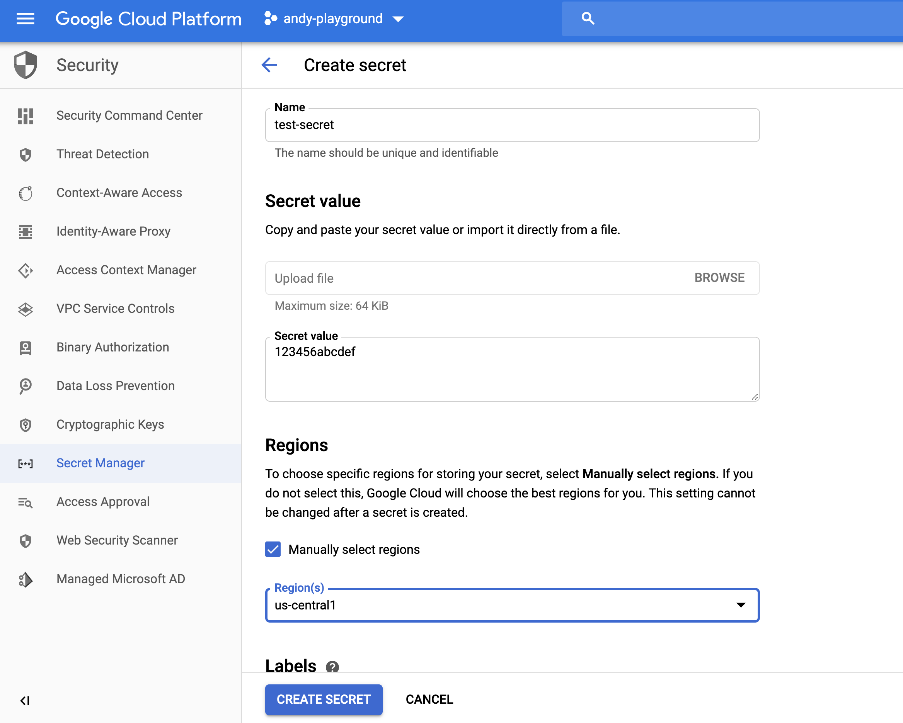
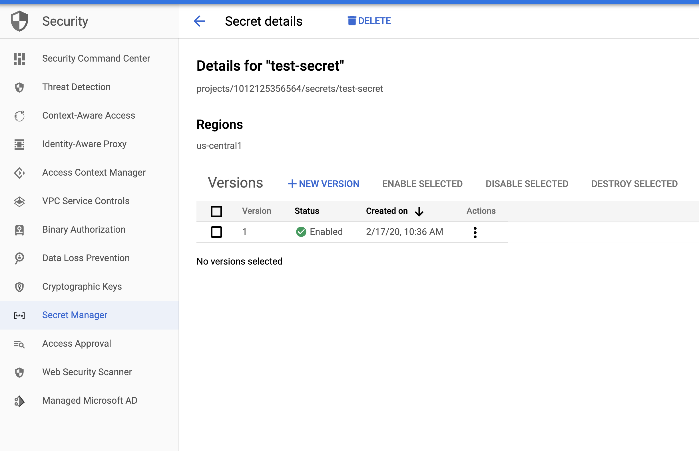
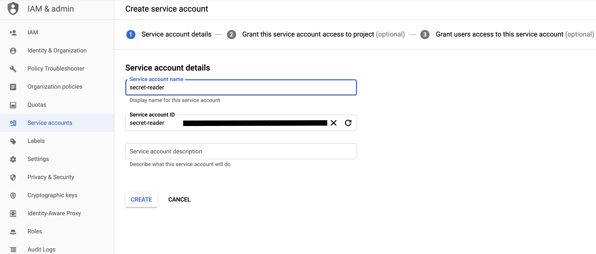
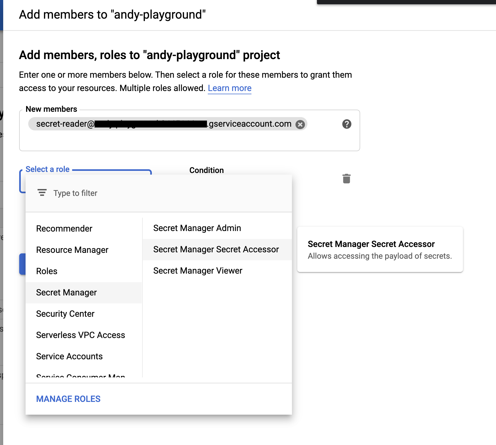
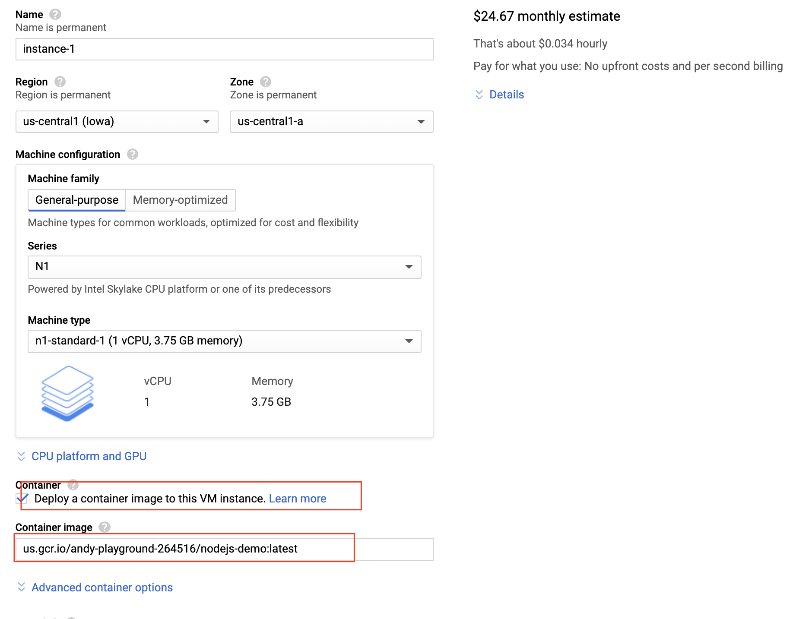
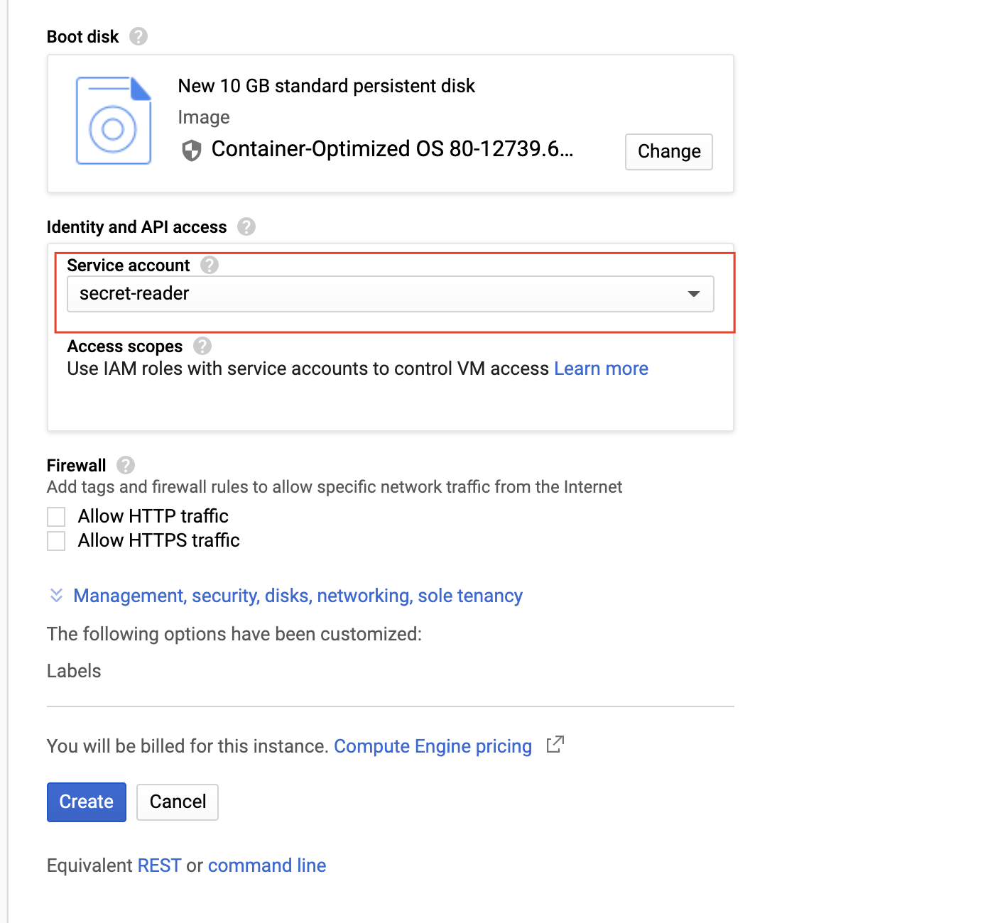

# secret-manager-nodejs-example

git clone https://github.com/doitintl/secret-manager-nodejs-example.git  
npm i 

node --version  
v13.6.0  
npm --version  
6.13.4  

# create a secret in GCP secret manager

  Under Security / Secret Manager from the GCP Console  
  

  Fill in the details and click create  

# Create a Service Account to access the secret
  Create Service Account  

  Assign Secret Manager Secret Accessor  

  *** ALSO ASSIGN STORAGE OBJECT VIEWER

  

# Dockerize the script
  gcloud auth configure-docker  
  docker build . -t us.gcr.io/andy-playground-264516/nodejs-demo:latest  
  docker push us.gcr.io/andy-playground-264516/nodejs-demo:latest  

# Create New Compute Instance with container source

  using same region for the instance as the secret was created in  

  
  
